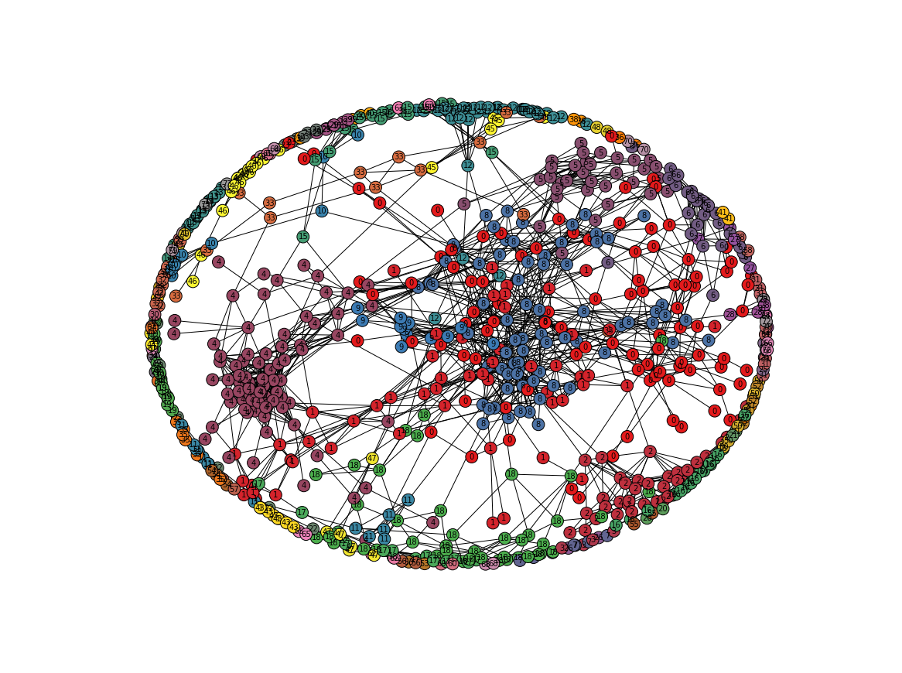

# Musicians' Similarity Network Analysis
## ADS Network project, [CUSP](cusp.edu.cn)
## Team
- Cindy Y. Liu
- Yuxiang Zhang

## Research Purpose
- Understand the similarity connections among hottest singers
- Simulate a basic music recommendation engine

## Roadmap
Data Processing:
- [X] Collecting Top Musician List Using API
- [X] Storing the data due to the limitation of API permission

Data Analysis:
- [X] Artist Network
   - Total Network Visualization
   - Centrality (Find the center of artist network)
   - Degree Distribution 
   - List the top similar artists given any one artist 
   - Find the artists' cluster (community detection)

~~- [ ] Song Network~~

## Report
[Musicians' Similarity Network Analysis]
(https://docs.google.com/document/d/1hvWprrs5Qq8B1tMEOF10XVfZaiPbgm2nJ49eJ-hjz2s/pub)

## Results
Network Visualization  

Community Partition  

